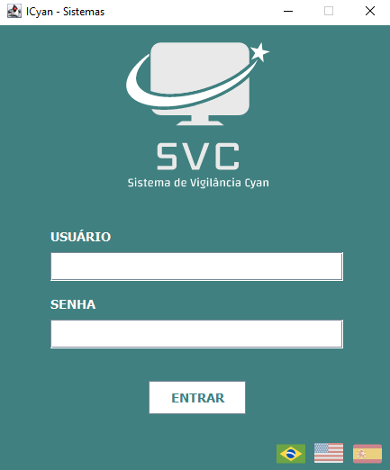
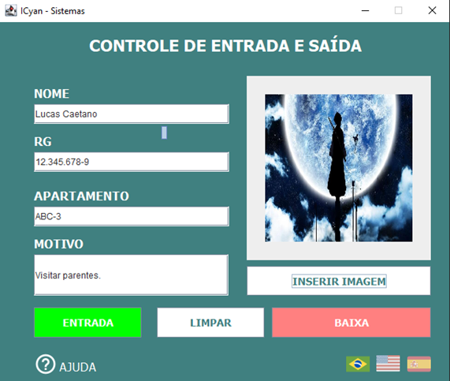
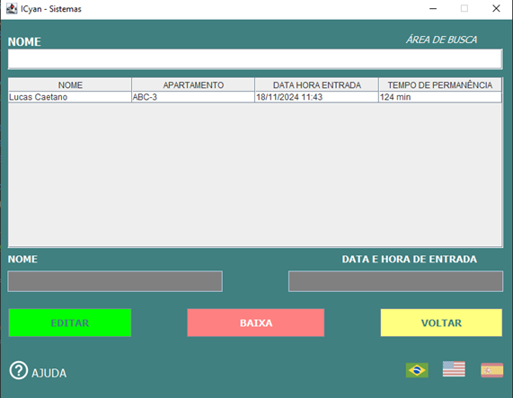
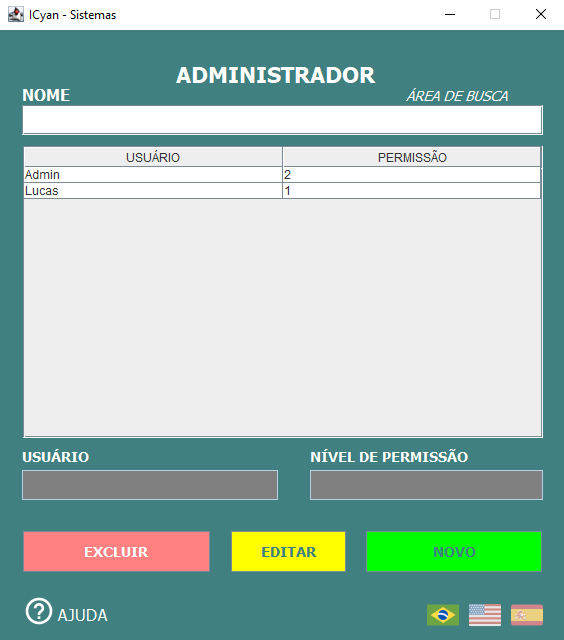
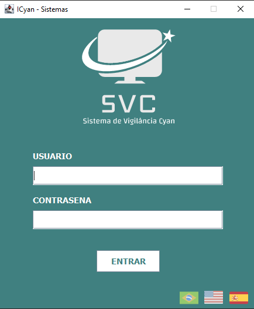
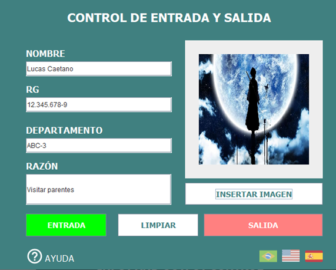
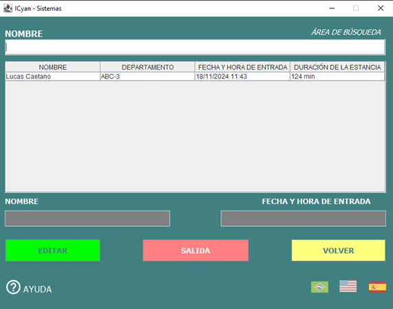
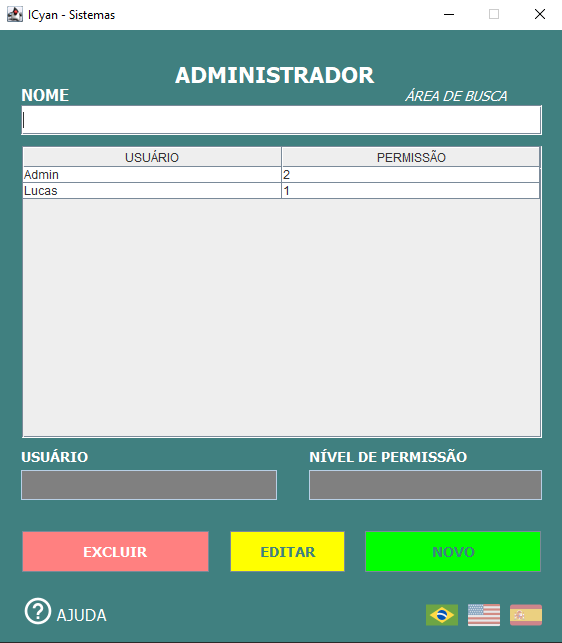

# 🛡 Sistema de Vigilância Multilíngue

Sistema de vigilância residencial com suporte a *três idiomas* (Português-Brasil 🇧🇷, Inglês 🇺🇸 e Espanhol 🇪🇸), desenvolvido em *Java com Swing* e banco de dados *SQLite. Conta com controle de entrada e saída de visitantes, sistema de login com diferenciação entre **usuários comuns* e *administradores*, além de criptografia de senhas e alertas automáticos.

---

## 🚀 Funcionalidades

### 🔐 Login

- Entrada por *usuário e senha*
- Redirecionamento com base no nível de permissão:
  - 1 → Usuário comum
  - 2 → Administrador

### 🧾 Home

- Campos para *Nome, **RG, **Apartamento, **Motivo da visita* e *Imagem do visitante*
- Ações:
  - Entrada: registra visitante no banco de dados
  - Limpar: limpa os campos da tela
  - Baixa: abre a tela de visitantes
  - Ajuda: passo a passo interativo

### 📋 Visitantes

- Tabela com visitantes presentes
- Campos: Nome, Apartamento, Data/Hora entrada, Tempo de permanência
- Ações:
  - Editar: altera dados do visitante
  - Baixa: registra saída e remove do banco
  - Voltar: retorna à tela anterior
  - Ajuda: passo a passo interativo

### 🛠 Administrador

- Tabela de usuários com permissões
- Ações:
  - Editar: altera dados do usuário
  - Excluir: remove usuário
  - Novo: cria novo usuário
  - Ajuda: passo a passo interativo

---

## 🌍 Suporte a Múltiplos Idiomas

Todas as telas contam com três bandeiras (🇧🇷 🇺🇸 🇪🇸) no canto inferior direito para alternar instantaneamente o idioma da interface.

Idiomas suportados:

- *Português (Brasil)*
- *Inglês (Estados Unidos)*
- *Espanhol (Espanha)*

---

## ⚙ Funcionalidades extras

- 🔒 *Criptografia de senhas* no banco de dados
- 🧠 *Sistema de alerta automático*: visitantes com mais de 1 hora de permanência geram notificação
- 🖼 *Conversão de imagens para binário* e armazenamento no banco

---

## 💾 Tecnologias utilizadas

- *Java* (versão compatível com Swing)
- *Java Swing* para interface gráfica
- *SQLite* para persistência local de dados
- *JDBC* para comunicação com o banco
- *Java OOP + MVC* como arquitetura

---

## 📁 Estrutura do projeto

text
📁 vigilancia-icyn/
├── src/                 # Código-fonte (controller, dao, model, view)
├── resources/           # Banco de dados SQLite + driver
├── icons/               # Ícones usados na interface
├── documents/           # Manuais do usuário (1 por idioma)
├── screenshots/         # Prints da interface organizadas por idioma
├── Vigilancia_iCyan.jar # Executável
├── .gitignore           # Arquivo Git
└── README.md            # Este arquivo

## 🖼 Interface (Brazil)

### Login

### Home

### Visitors

### Administrator

## 🖼 Interface (Spain)

### Login

### Home

### Visitors

### Administrator

## 🖼 Interface (United States)

### Login

### Home

### Visitors

### Administrator

## 📝 Como executar

1. Certifique-se de ter o Java JDK instalado

2. Clone o repositório:

   bash
   git clone https://github.com/lucas-caetano-developer/vigilancia-java.git
   

3. Execute o JAR
   bash
   java -jar Vigilancia_iCyan.jar
   
   Obs: não é necessário instalar o banco, pois o .db já está incluído no projeto.

## 📚 Manuais do usuário

Disponíveis na pasta documents/:

- 🇧🇷 Manual do Usuário - Brasil
- 🇺🇸 User Manual - United States
- 🇪🇸 Manual del Usuario - España

## 📝 Licença

Copyright (c) 2025 Lucas Caetano

Este software é fornecido gratuitamente para fins educacionais, acadêmicos e pessoais.

Você TEM permissão para:

- Baixar e estudar o código
- Modificar para uso próprio
- Usar em projetos acadêmicos ou de aprendizado

Você NÃO TEM permissão para:

- Usar este software, total ou parcialmente, para fins comerciais
- Vender, alugar, sublicenciar ou distribuir com fins lucrativos
- Incorporar este software em produtos ou serviços comerciais

Este projeto é fornecido "no estado em que se encontra", sem garantias de qualquer tipo. O autor não se responsabiliza por qualquer dano direto ou indireto decorrente do uso do software.

Para obter permissão para usos fora do escopo acima, entre em contato com o autor:

## 👤 Autor

Lucas Caetano  
GitHub: [lucas-caetano-developer](https://github.com/lucas-caetano-developer)